 

  

 

## 🔺 Diagnostics Panel

| ⚙️ | Reading |
|---|---|
| **Designation** | Kaavya Sarin |
| **Class** | CS Undergrad |
| **Secondary Interest** | Business Studies |
| **Core Languages** | Python · Java · C · C++ · HTML/CSS |
| **Current Mission** | Learning full-stack dev & databases |
| **Status** | 🟢 Open to collaboration |

 

## ⚡ Tech Stack

 

## 📊 System Stats

<table align="center">
<tr>
<td valign="top" width="50%">

</td>
<td valign="top" width="50%">

</td>
</tr>
</table>

  

  

## 🧠 Featured Builds

| Project | Description | Tech |
|---|---|---|
| 🏥 **[Hospital Management System](https://github.com/sarinkaavya19-ai)** | OPD, Emergency & IPD modules built with structured OOP concepts | `C++` |
| 📇 **[Contact Management System](https://github.com/sarinkaavya19-ai/contact-management-system-c)** | Menu-driven system with add/delete/search + PIN authentication & dynamic memory allocation | `C` |
| 🏫 **[College Student Office Management](https://github.com/sarinkaavya19-ai/college-student-office-management-system)** | Desktop app with GUI + database integration for student office workflows | `Python` `Tkinter` `MySQL` |
| 🍔 **[MessMate](https://github.com/sarinkaavya19-ai/messmate)** | AI-powered hostel meal planner | `HTML` |
| 📊 **[Browser History Visualizer](https://github.com/sarinkaavya19-ai/Browser-History-Visualizer)** | Full-stack analytics engine & dashboard for browsing history | `Full-Stack` |
| 🌐 **[HTML/CSS Practice](https://github.com/sarinkaavya19-ai/html-css-practice)** | A growing collection of front-end practice snippets | `HTML` `CSS` |

 

## 🔧 Suit Systems

| Suit System | Real-World Translation |
|---|---|
| ⚛️ Arc Reactor | Core languages that keep every project powered — Python, Java, C/C++ |
| 🛰️ HUD & Sensors | Debugging — finding the problem before it finds you |
| 🤖 J.A.R.V.I.S. | Currently training my own — learning full-stack + DB design |
| 🛠️ Workshop | Where messy class assignments turn into actual working systems |

 

> *"I am Iron Man."* — well, not quite yet. Still assembling the suit, one repo at a time. 🔩

 

## 📫 Let's Connect

  

